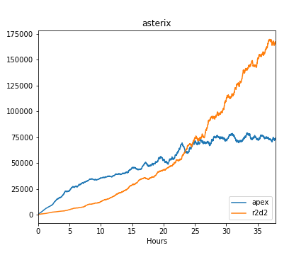
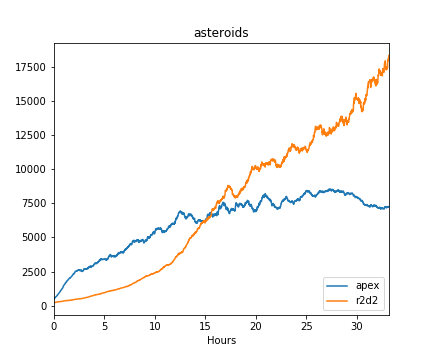
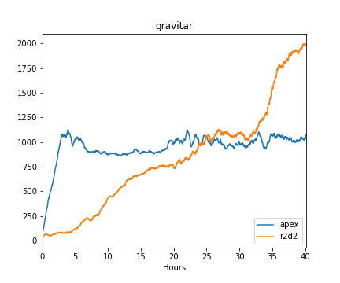
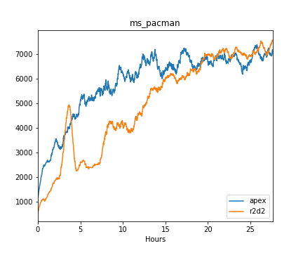
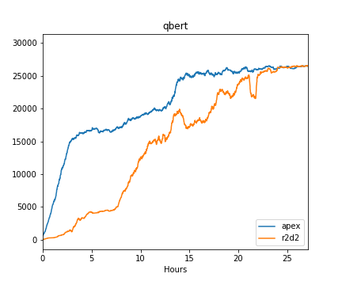
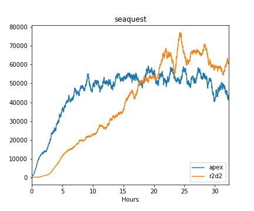

# Reinforcement Learning Assembly

## Intro
RL Assembly is a collections of implementations of
[Ape-X](https://openreview.net/pdf?id=H1Dy---0Z) and
[R2D2](https://openreview.net/pdf?id=r1lyTjAqYX), together with
necessary infra such prioritized replay and environments like atari.

## Key Implementation Choices

### TorchScript for synchronizing model between C++ & Python

We run a large number of simulations & model inference in C++ while
run training in Python. This requires the model being updated in
Python while being used for inference in C++. We use **TorchScript**
to achieve that. The model is defined **once** in Python with
[TorchScript
annotations](https://github.com/facebookresearch/rela/blob/master/pyrela/apex.py#L56),
and can be used in both places.

### One thread runs multiple simulators in a for-loop

Often simple environments like Atari
are too cheap to exhaust a CPU core. Meanwhile, running too many
threads (much more than # CPU) can cause unwanted overhead on context
switching. So we run **K** instances of simulators in for-loop
in each thread. We then form a small batch of **K** elements for that
particular thread and run model inference on it. For the case of Atari
& Hanabi, **K** can often be 80 or 120, resulting a decent batch size
of 80/120 per thread. We often create 60 or 80 threads on our
machine with 40 cores / 80 HyperThreads.


## Compile & Run

### Prerequisite

Install `cudnn7.3`, `cuda9.2` and `gcc7`. This might be
platform dependent. Other versions might also work but we have only
tested with the above versions. Note that we discovered a deadlock
problem when using tensors with C++ multi-threading when using
`cuda10.0` on Pascal GPU.

Create your own conda env & **compile PyTorch** from source.
If PyTorch and this repo are compiled by compilers with
different ABI compatibility, mysterious bugs that unexpectedly corrupt memory
may occur. To avoid that, the current solution is to
compile & install PyTorch from source first and then compile
this repo against that PyTorch binary.
For convenience, we paste instructions of compling PyTorch here.

```bash
# create a fresh conda environment with python3
conda create --name [your env name] python=3.7
conda activate [your env name]

conda install numpy pyyaml mkl mkl-include setuptools cmake cffi typing
conda install -c pytorch magma-cuda92

# clone pytorch
git clone -b v1.3.0 --recursive https://github.com/pytorch/pytorch
cd pytorch

export CMAKE_PREFIX_PATH=${CONDA_PREFIX:-"$(dirname $(which conda))/../"}
# set cuda arch list so that the built binary can be run on both pascal and volta
TORCH_CUDA_ARCH_LIST="6.0;7.0" python setup.py install
```

### Clone & Build this repo
For convenience, add the following lines to your `.bashrc` to set path.
```bash
CONDA_PREFIX=${CONDA_PREFIX:-"$(dirname $(which conda))/../"}
export CPATH=${CONDA_PREFIX}/include:${CPATH}
export LIBRARY_PATH=${CONDA_PREFIX}/lib:${LIBRARY_PATH}
export LD_LIBRARY_PATH=${CONDA_PREFIX}/lib:${LD_LIBRARY_PATH}
```

Clone this repo.
```bash
git clone --recursive https://github.com/facebookresearch/rela.git
```

Install additional dependencies
```
pip install tensorboardX
conda install zlib
# if the current cmake version is < 3.15
conda install -c conda-forge cmake
```

Then to build this repo with atari.
```bash
cd ROOT

cd atari
# build atari
cd Arcade-Learning-Environment
mkdir build
cd build
cmake -DUSE_SDL=OFF -DUSE_RLGLUE=OFF -DBUILD_EXAMPLES=OFF ..
make -j40

# build rela & atari env wrapper
cd ../..  # go back to rela/atari
mkdir build
cd build
cmake ..
make
```

Add symlink for roms. We can obtain roms by install `atari_py`.
```
pip install atari_py

cd ROOT
cd atari
mkdir roms; cd roms
# we can find where atari_py is installed and copy/symlink the roms here.
# If CONDA_PREFIX is set properly & python version is 3.7,
# the following command should work.
ln -s $CONDA_PREFIX/lib/python3.7/site-packages/atari_py/atari_roms/* ./
```

### Run
Note that we need to set the following before running any multi-threading
program that uses torch::Tensor. Otherwise a simple tensor operation will
use all cores by default. (ignore if you have put this line in your `bashrc`.)
```bash
export OMP_NUM_THREADS=1
```
`pyrela/scripts` contains some examples scripts for training/debugging
```bash
cd pyrela

# for fast launching & debugging
sh scripts/ref_dev.sh

# example run of apex training
# this will create 2400 atari envs, which may take a while
# adjust --num_thread, --num_game_per_thread, --act_device
# according to your hardware setting
sh scripts/ref_run_apex.sh

# example run of apex training
sh scripts/ref_run_r2d2.sh
```

## Learning Curves
For simplicity, these models are trained & evaluated with **1 life** per episode regardless
of how many lives the game environment provides.

 
 
 


## Contribute

### Python
use [`black`](https://github.com/psf/black) to format python code,
run `black *.py` before pushing

### C++
the root contains a `.clang-format` file that define the coding style of
this repo, run the following command before submitting PR or push
```bash
clang-format -i *.h
clang-format -i *.cc
```

## License
Reinforcement Learning Assembly is licensed under [MIT License](LICENSE).
